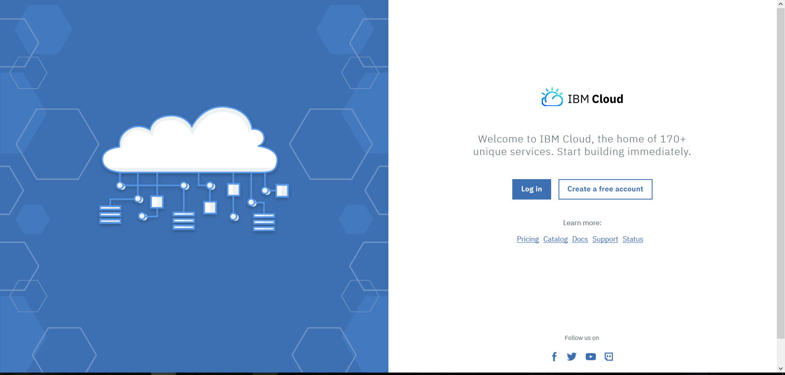
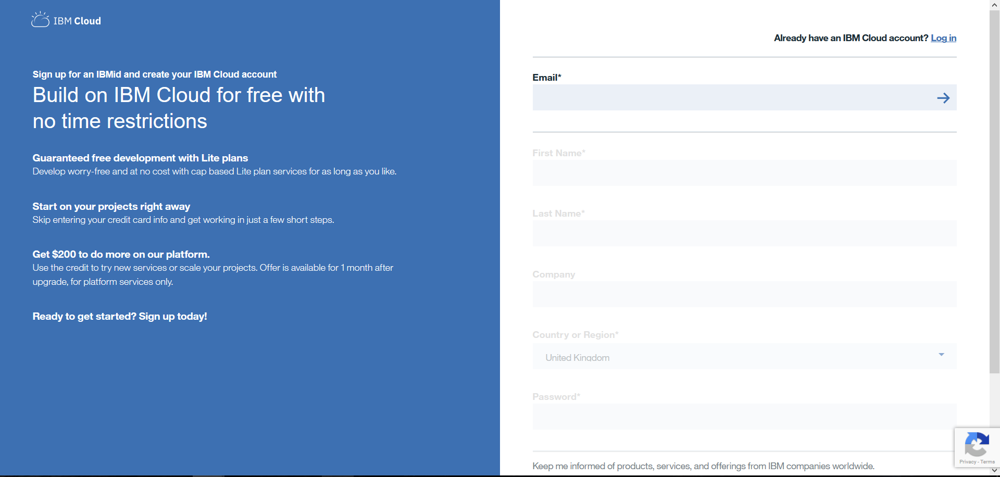
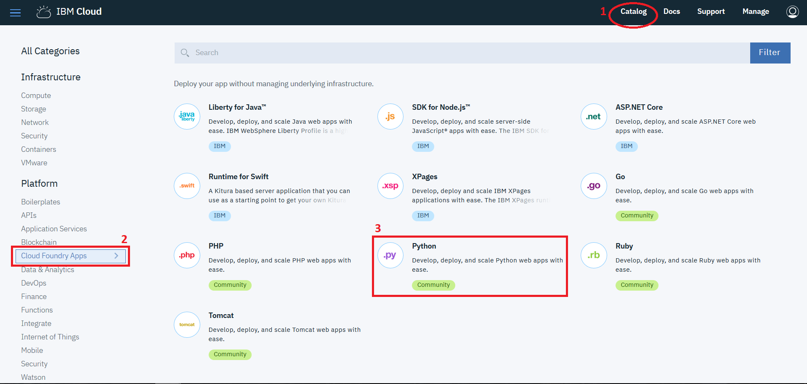
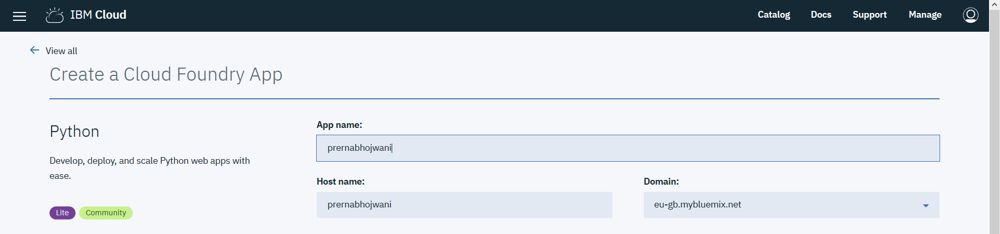
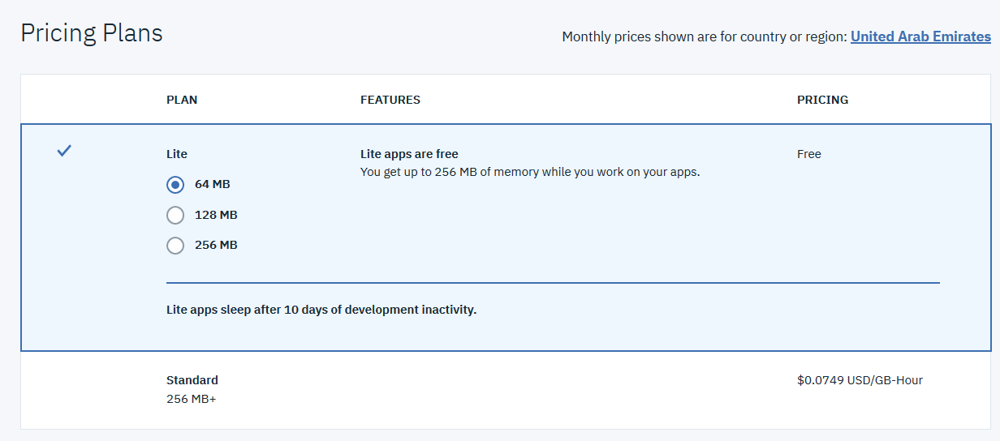
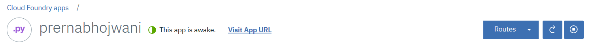

# Coffee-Code

## Create a webpage in 3 steps

### Step 1: Sign up for IBM Cloud

Go to http://ibm.biz/astrolabs, click 'Create a free account' 

and fill in email, name, password, etc

### Step 2: Create the application

After registering successfully, select 'Catalog' and then 'Cloud Foundry Apps'

For this tutorial, we'll be creating a Python app, so we'll select the Python tile

Give a name for your application. Your app name will be the host name as well, so it must be unique!

By default, the Lite plan is selected, select the amount of memory you'd like to allocate and click 'Create'

### Step 3: 

That's it! There you have it, you just created and deployed a website.

Click on 'Visit app URL' to take a look at the website

